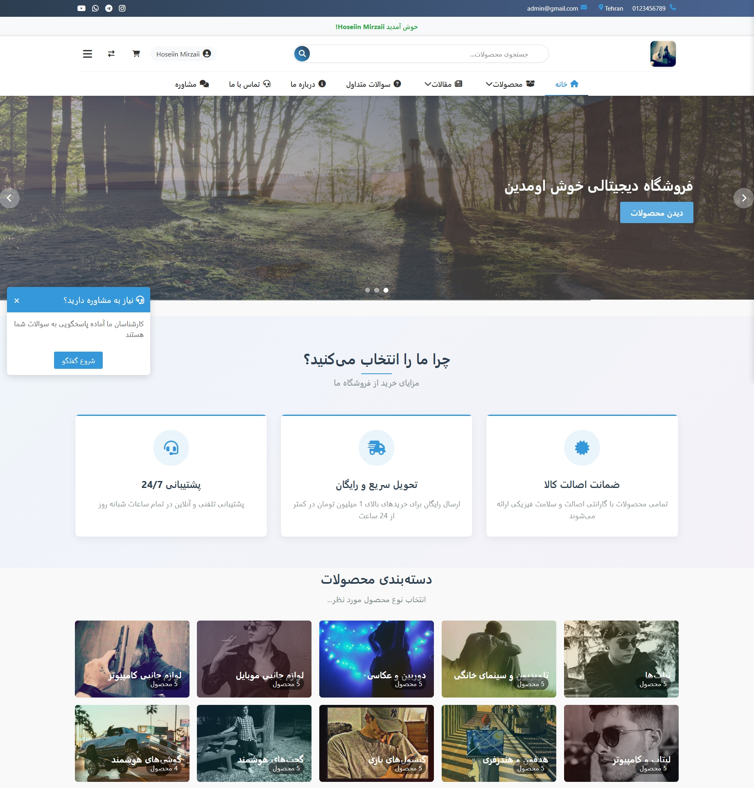
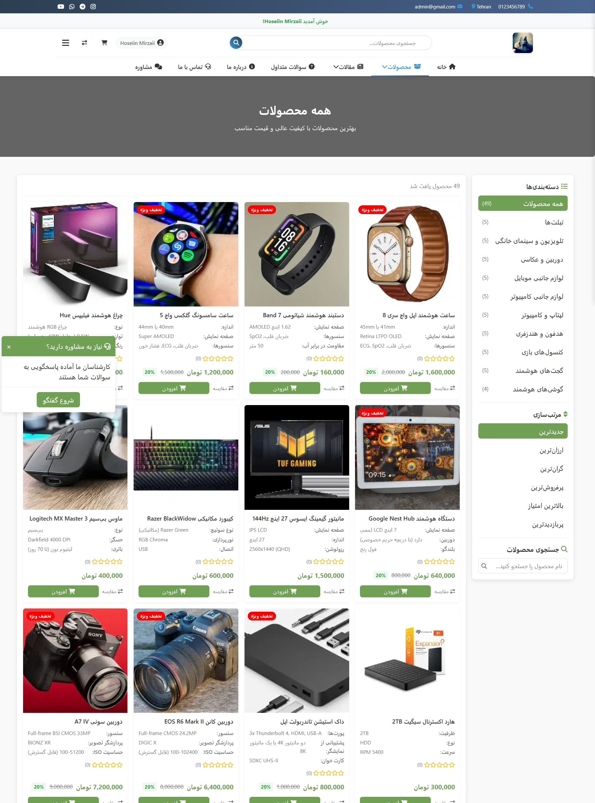
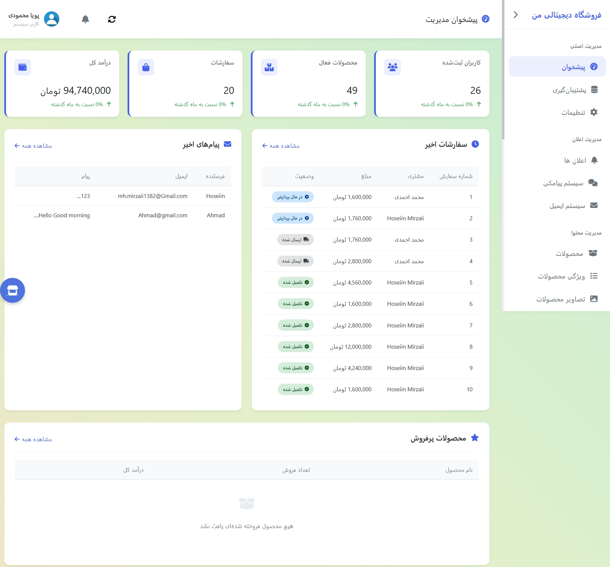

# 🛍️ پروژه فروشگاه دیجیتال (Digital Shop)

یه فروشگاه اینترنتی کامل و حرفه‌ای، آماده برای تحویل دانشگاه. با PHP خام و MySQL نوشته شده.

---

## 🖼️ چندتا عکس از پروژه

---

## ✨ امکانات پروژه

### 🛍️ بخش فروشگاه
- ثبت‌نام و ورود کاربران
- نمایش محصولات با دسته‌بندی
- صفحه جزئیات محصول با مشخصات کامل
- تصاویر چندگانه برای هر محصول
- ویژگی‌های محصولات (سایز، رنگ و...)
- سبد خرید
- ثبت سفارش و پیگیری وضعیت
- سیستم پرداخت (آنلاین و پرداخت در محل)
- کدهای تخفیف (درصدی و مبلغ ثابت)
- مقایسه محصولات
- لیست علاقه‌مندی‌ها
- نظرات و امتیازدهی کاربران
- آمار بازدید محصولات

### 📝 بخش محتوا
- مقالات و بلاگ
- سوالات متداول (FAQ)
- صفحه درباره ما
- اعضای تیم
- تماس با ما
- اسلایدرهای تبلیغاتی

### 🔐 پنل مدیریت
- داشبورد مدیریتی با آمار
- مدیریت کامل محصولات
- مدیریت دسته‌بندی‌ها
- مدیریت سفارش‌ها و تغییر وضعیت
- مدیریت کاربران
- مدیریت تخفیف‌ها
- مدیریت مقالات
- مدیریت اسلایدرها
- مدیریت سوالات متداول
- مدیریت نظرات
- تنظیمات فروشگاه (نام، لوگو، شبکه‌های اجتماعی)
- اعلان‌های مدیریتی (سفارش جدید، کاربر جدید و...)

### 💬 مشاوره
- سیستم مشاوره با ادمین
- گفتگوی زنده
- تاریخچه پیام‌ها

---

## 🗄️ جداول دیتابیس

| جدول | توضیح |
|------|-------|
| Users | کاربران (ادمین و کاربر عادی) |
| Categories | دسته‌بندی محصولات |
| Products | محصولات |
| ProductAttributes | ویژگی‌های محصولات |
| ProductImages | تصاویر محصولات |
| ProductComparison | مقایسه محصولات |
| Discounts | کدهای تخفیف |
| Orders | سفارش‌ها |
| OrderDetails | جزئیات سفارش |
| Payments | پرداخت‌ها |
| Reviews | نظرات و امتیازها |
| ProductViews | آمار بازدید محصولات |
| Favorites | لیست علاقه‌مندی‌ها |
| Articles | مقالات و بلاگ |
| FAQs | سوالات متداول |
| AboutUs | درباره ما |
| TeamMembers | اعضای تیم |
| ContactMessages | پیام‌های تماس با ما |
| Consultations | جلسات مشاوره |
| ConsultationMessages | پیام‌های مشاوره |
| Notifications | اعلان‌ها |
| ShopSettings | تنظیمات فروشگاه |
| ShopSliders | اسلایدرها |

---

## 🛠️ تکنولوژی‌ها

- HTML5 / CSS3
- JavaScript
- Bootstrap 5
- PHP (بدون فریمورک)
- MySQL

---

## 📞 راه‌های ارتباط با من

- 📧 **ایمیل:** mh.mirzaii1382@gmail.com
- 📱 **تلگرام:** [@hoseiin_28](https://t.me/hoseiin_28)
- 📷 **اینستاگرام:** [@Hoseiin_28](https://instagram.com/Hoseiin_28)
- 💼 **لینکدین:** [Hoseiin Mirzaii](https://linkedin.com/in/Hoseiin_28)

---

## 👨‍💻 درباره من

محمدحسین میرزایی هستم، دانشجوی کارشناسی کامپیوتر و برنامه‌نویس فول‌استک PHP. پروژه‌های دانشجویی و سفارشی انجام می‌دم.

---

⭐ **اگه پروژه رو پسندیدی، یه ستاره بده!**
💬 **برای سفارش پروژه مشابه، پیام بده.**
